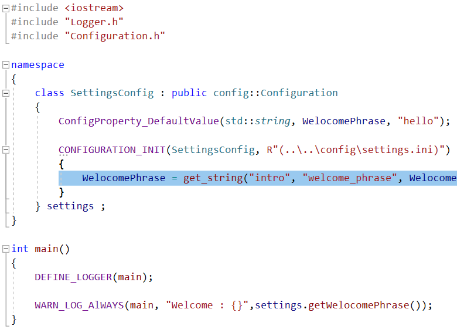

# C++ project template

## Usage

	...

## Installation

	run scripts\generate_solution.bat

## Properties

* Log
* Event
* Configuration
* Ranges
* User input

## License

Modified BSD License (3-Clause BSD license) see the file LICENSE in the project root.
